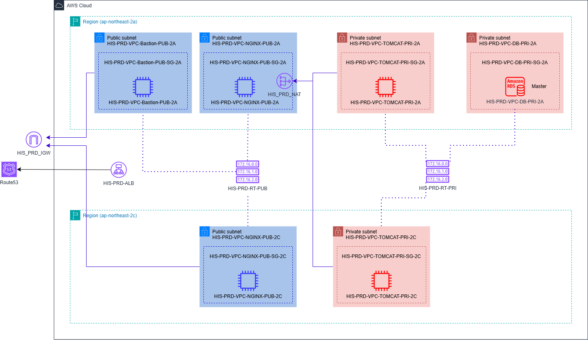

# 🏛️ AWS 3-Tier Web Service Architecture Project

> AWS 환경에서의 3-Tier 웹 서비스 아키텍처 구축 — Nginx · Tomcat · RDS(MySQL) · ALB · Route 53

<br>

## 목차

1. [프로젝트 개요](#1-프로젝트-개요)
2. [핵심 기술 및 아키텍처 이론](#2-핵심-기술-및-아키텍처-이론)
3. [인프라 설계도 및 워크플로우](#3-인프라-설계도-및-워크플로우)
4. [네트워크 환경 구성](#4-네트워크-환경-구성)
5. [EC2 및 Bastion Host 운영](#5-ec2-및-bastion-host-운영)
6. [Load Balancer 구축](#6-load-balancer-구축)
7. [관계형 데이터베이스(RDS) 구축](#7-관계형-데이터베이스rds-구축)
8. [티어별 서비스 연동](#8-티어별-서비스-연동)
9. [아키텍처 설계 고안점](#9-아키텍처-설계-고안점)

<br>

---

## 1. 프로젝트 개요

| 항목 | 내용 |
|------|------|
| **프로젝트명** | AWS 3-Tier Infrastructure |
| **기간** | 2026.04 |
| **유형** | 팀 프로젝트 |
| **팀 구성** | 김동진 · 이영훈 · 장규혁 · 정성현 |
| **리전** | 서울 (ap-northeast-2) |

### 프로젝트 목표

| 목표 | 내용 |
|------|------|
| **3-Tier 아키텍처 구현** | Nginx(Web) · Tomcat(WAS) · RDS(DB)를 독립된 계층으로 구성하고 상호 데이터 연동 |
| **서비스 부하 분산** | ALB를 통한 트래픽 분산으로 특정 서버 장애가 전체로 확산되지 않도록 구성 |
| **네트워크 영역 분리** | Public/Private 서브넷 용도별 분리, 보안 그룹과 Bastion Host로 외부 노출 최소화 |

<br>

---

## 2. 핵심 기술 및 아키텍처 이론

### 사용 기술 스택

| 분류 | 서비스 | 설명 |
|------|--------|------|
| **네트워크** | VPC | 클라우드 환경에서 사용자가 생성하고 관리하는 독립적인 가상 네트워크 공간 |
| | Subnet | 네트워크 영역을 분할하여 더 작은 크기의 네트워크로 쪼갠 영역 |
| | Routing Table | 목적지 주소를 네트워크 노선으로 변환시키는 정의서 |
| | Internet Gateway | VPC와 인터넷 사이 통신을 가능하게 하는 고가용성 컴포넌트 |
| | NAT Gateway | 사설 IP와 공인 IP의 상호변환을 담당하는 VPC 컴포넌트 |
| **컴퓨팅** | EC2 | AWS 클라우드 환경의 가상 서버 |
| **보안** | Security Group | 리소스에 도달/나가는 트래픽을 제어하는 가상 방화벽 |
| **로드밸런싱** | ELB(ALB) | 트래픽을 여러 대상에 분산시키는 서비스 |
| | Target Group | ELB 백엔드 서버를 논리적으로 묶어 관리하는 그룹 |
| **DNS** | Route 53 | AWS의 안정적이고 확장 가능한 DNS 웹 서비스 |
| **데이터베이스** | RDS (MySQL) | AWS 관리형 관계형 데이터베이스 서비스 |

### 3-Tier Architecture

애플리케이션을 3개의 논리적/물리적 계층으로 분리해 운영하는 아키텍처. 각 계층이 독립된 인프라에서 동작하므로 다른 계층에 영향 없이 업데이트/확장이 가능합니다.

| 계층 | 역할 | 본 프로젝트 적용 |
|------|------|----------------|
| **Presentation Tier** | UI 담당, 사용자 요청을 가장 먼저 처리 | Nginx (Public Subnet) |
| **Application Tier** | 비즈니스 로직 처리, DB 연동 | Tomcat (Private Subnet) |
| **Data Tier** | 정보 저장 및 관리 | RDS MySQL (Private Subnet) |

<br>

---

## 3. 인프라 설계도 및 워크플로우



### 트래픽 흐름

```
Internet → Route 53 (history-cloud.store)
        → ALB (HIS-PRD-ALB)
        → Nginx (Public Subnet, 2A/2C)
        → Tomcat (Private Subnet, 2A/2C)
        → RDS MySQL (Private Subnet, 2A)
```

### 주요 리소스 현황 요약

| 리소스 | 수량 |
|--------|------|
| VPC | 1 |
| 서브넷 | 7 |
| 보안 그룹 | 8 |
| EC2 | 5 |
| NAT GW | 1 |
| ALB | 1 |
| Route 53 | 1 |
| RDS | 1 |

<br>

---

## 4. 네트워크 환경 구성

### VPC

| 이름 | CIDR | DNS 호스트 이름 |
|------|------|----------------|
| HIS-PRD-VPC | 10.250.0.0/16 | 활성화 |

### 서브넷 (총 7개)

| 서브넷 이름 | CIDR | 가용 영역 | 접근 유형 | 용도 |
|------------|------|----------|----------|------|
| HIS-PRD-VPC-BASTION-PUB-2A | 10.250.4.0/24 | ap-northeast-2a | Public | Bastion Host |
| HIS-PRD-VPC-NGINX-PUB-2A | 10.250.1.0/24 | ap-northeast-2a | Public | Nginx Web |
| HIS-PRD-VPC-NGINX-PUB-2C | 10.250.11.0/24 | ap-northeast-2c | Public | Nginx Web |
| HIS-PRD-VPC-TOMCAT-PRI-2A | 10.250.2.0/24 | ap-northeast-2a | Private | Tomcat WAS |
| HIS-PRD-VPC-TOMCAT-PRI-2C | 10.250.12.0/24 | ap-northeast-2c | Private | Tomcat WAS |
| HIS-PRD-VPC-DB-PRI-2A | 10.250.3.0/24 | ap-northeast-2a | Private | RDS |
| HIS-PRD-VPC-DB-PRI-2C | 10.250.13.0/24 | ap-northeast-2c | Private | RDS |

### Internet Gateway / NAT Gateway

| 리소스 | 이름 | 연결 |
|--------|------|------|
| Internet Gateway | HIS-PRD-IGW | HIS-PRD-VPC (Public 서브넷에 인터넷 경로 제공) |
| NAT Gateway | HIS-PRD-NAT-2A | NGINX-PUB-2A 서브넷에 배치, HIS-PRD-RT-PRI에 연결 |

### Routing Table

| 이름 | 라우팅 | 연결 서브넷 |
|------|--------|----------|
| HIS-PRD-RT-PUB | local + IGW | NGINX-PUB-2A/2C, BASTION-PUB-2A |
| HIS-PRD-RT-PRI | local + NAT | TOMCAT-PRI-2A/2C, DB-PRI-2A/2C |

### 보안 그룹 인바운드 규칙

| 보안 그룹 | 연결 리소스 | 프로토콜 | 포트 | 소스 | 설명 |
|----------|-----------|---------|------|------|------|
| HIS-PRD-VPC-Bastion-PUB-SG-2A | Bastion EC2 | TCP | 22, 80, 443 | 0.0.0.0/0 | SSH/HTTP/HTTPS |
| HIS-PRD-VPC-NGINX-PUB-SG-2A | Nginx EC2 (2A) | TCP | 22, 80, 443 | 0.0.0.0/0 | SSH/HTTP/HTTPS |
| HIS-PRD-VPC-NGINX-PUB-SG-2C | Nginx EC2 (2C) | TCP | 22, 80, 443 | 0.0.0.0/0 | SSH/HTTP/HTTPS |
| HIS-PRD-VPC-TOMCAT-PRI-SG-2A | Tomcat EC2 (2A) | TCP | 22, 8080 | 0.0.0.0/0 | SSH/Tomcat |
| HIS-PRD-VPC-TOMCAT-PRI-SG-2C | Tomcat EC2 (2C) | TCP | 22, 8080 | 0.0.0.0/0 | SSH/Tomcat |
| HIS-PRD-VPC-DB-PRI-SG-2A | RDS (2A) | TCP | 3306 | TOMCAT SG | MySQL (Tomcat에서만 접근) |
| HIS-PRD-VPC-DB-PRI-SG-2C | RDS (2C) | TCP | 3306 | TOMCAT SG | MySQL |
| HIS-PRD-ALB-SG | ALB | TCP | 80, 443 | 0.0.0.0/0 | HTTP/HTTPS |

<br>

---

## 5. EC2 및 Bastion Host 운영

### EC2 인스턴스 목록

| EC2 이름 | 역할 | 가용 영역 | 인스턴스 타입 | 내부 IP | 퍼블릭 IP |
|---------|------|----------|-------------|---------|----------|
| HIS-PRD-VPC-Bastion-PUB-2A | Bastion | ap-northeast-2a | t3.micro | 10.250.4.240 | 활성화 |
| HIS-PRD-VPC-NGINX-PUB-2A | Nginx | ap-northeast-2a | t3.micro | 10.250.1.240 | 활성화 |
| HIS-PRD-VPC-NGINX-PUB-2C | Nginx | ap-northeast-2c | t3.micro | 10.250.11.240 | 활성화 |
| HIS-PRD-VPC-TOMCAT-PRI-2A | Tomcat WAS | ap-northeast-2a | t3.micro | 10.250.2.240 | 비활성화 |
| HIS-PRD-VPC-TOMCAT-PRI-2C | Tomcat WAS | ap-northeast-2c | t3.micro | 10.250.12.240 | 비활성화 |

> 공통: Ubuntu Server 24.04 LTS · Key Pair: his-keypair.pem

<br>

---

## 6. Load Balancer 구축

### ALB

| 항목 | 값 |
|------|-----|
| 이름 | HIS-PRD-ALB |
| 타입 | Application |
| 체계 | 인터넷 경계 |
| VPC | HIS-PRD-VPC |
| 가용 영역 | NGINX-PUB-2A (ap-northeast-2a), NGINX-PUB-2C (ap-northeast-2c) |
| 보안 그룹 | HIS-PRD-ALB-SG |
| 타겟 그룹 | HIS-PRD-ALB-TG |
| 리스너 | HTTP:80, HTTPS:443 → HIS-PRD-ALB-TG |

### Target Group

| 이름 | 기본 구성 | 포트 | 등록 인스턴스 |
|------|---------|------|-------------|
| HIS-PRD-ALB-TG | 인스턴스 | 80 | HIS-PRD-VPC-NGINX-PUB-2A, HIS-PRD-VPC-NGINX-PUB-2C |

### Route 53 DNS 레코드

| 레코드 이름 | 유형 | 별칭 | 트래픽 대상 | 라우팅 정책 |
|-----------|------|------|-----------|-----------|
| @ (루트 도메인) | A | 예 | ALB (HIS-PRD-ALB) | 단순 라우팅 |
| www | A | 예 | ALB (HIS-PRD-ALB) | 단순 라우팅 |

> 도메인: history-cloud.store

<br>

---

## 7. 티어별 서비스 연동

### Nginx 설치

```bash
# 1. 저장소 파일 생성 및 내용 넣기
sudo vi /etc/apt/sources.list.d/nginx.list

deb [signed-by=/usr/share/keyrings/nginx-archive-keyring.gpg] https://nginx.org/packages/ubuntu jammy nginx
deb-src [signed-by=/usr/share/keyrings/nginx-archive-keyring.gpg] https://nginx.org/packages/ubuntu jammy nginx

# 2. GPG 키 추가
curl -fsSL https://nginx.org/keys/nginx_signing.key | sudo gpg --dearmor -o /usr/share/keyrings/nginx-archive-keyring.gpg

# 3. 저장소 업데이트 및 설치
sudo apt update
sudo apt install -y nginx

# 4. 버전 확인 및 시작
nginx -v
sudo systemctl start nginx
sudo systemctl enable nginx
```

### Tomcat 설치

```bash
# 1. OpenJDK 설치
sudo apt install -y openjdk-11-jdk

# 2. 환경변수 추가 (/etc/profile)
export JAVA_HOME=/usr/lib/jvm/java-11-openjdk-amd64
export PATH=$PATH:$JAVA_HOME/bin
export CLASSPATH=$JAVA_HOME/lib/tools.jar

# 3. Tomcat 설치
wget https://archive.apache.org/dist/tomcat/tomcat-9/v9.0.108/bin/apache-tomcat-9.0.108.tar.gz
sudo groupadd tomcat
sudo mkdir /home/tomcat
sudo tar -xf apache-tomcat-9.0.108.tar.gz -C /home/tomcat/
sudo useradd -s /usr/sbin/nologin -g tomcat -d /home/tomcat tomcat
ls /home/tomcat/apache-tomcat-9.0.108/

# 3-1. systemd 서비스 등록
sudo vi /etc/systemd/system/tomcat.service

# 3-2. 권한 설정 및 서비스 활성화
sudo systemctl daemon-reload
sudo systemctl enable tomcat.service
sudo chgrp -R tomcat /home/tomcat/
sudo chown -R tomcat /home/tomcat/
sudo chmod +x /home/tomcat/apache-tomcat-9.0.108/bin/*.sh
sudo systemctl start tomcat
ps -ef|grep tomcat
```

### Nginx 리버스 프록시 설정 (2A)

```nginx
# /etc/nginx/conf.d/default.conf
server {
    listen 80;
    server_name localhost;

    # Tomcat 서버로 모든 요청 프록시
    location / {
        proxy_pass http://10.250.2.240:8080;
        proxy_set_header Host $host;
        proxy_set_header X-Real-IP $remote_addr;
        proxy_set_header X-Forwarded-For $proxy_add_x_forwarded_for;
        proxy_set_header X-Forwarded-Proto $scheme;
        proxy_connect_timeout 300;
        proxy_send_timeout 300;
        proxy_read_timeout 300;
    }
}
```

```bash
# GPG 키 추가
sudo nginx -t
nginx: the configuration file /etc/nginx/nginx.conf syntax is ok
nginx: configuration file /etc/nginx/nginx.conf test is successful

# nginx 재가동
sudo systemctl restart nginx
```

### Bastion → Nginx/Tomcat .jsp 파일 배포

```bash
# Bastion에서 .jsp 파일 확인
ubuntu@bastion:~$ ls
delete.jsp  edit.jsp  index.jsp  list.jsp  view.jsp  write.jsp

# Tomcat 서버 2대로 전송
scp *.jsp tomcat2a:/home/ubuntu/
scp *.jsp tomcat2c:/home/ubuntu/
```

### Tomcat 서버 - .jsp 파일을 ROOT로 이동

```bash
cd /home/ubuntu
sudo mv *.jsp /home/tomcat/apache-tomcat-9.0.108/webapps/ROOT/
sudo chown tomcat:tomcat /home/tomcat/apache-tomcat-9.0.108/webapps/ROOT/*.jsp
```

### Tomcat - RDS(MySQL) 연동

```bash
# 1. MySQL JDBC 드라이버 설치
wget https://dev.mysql.com/get/Downloads/Connector-J/mysql-connector-j-8.x.x.tar.gz

# 2. server.xml — 글로벌 네이밍 리소스 설정
sudo vi /home/tomcat/apache-tomcat-9.0.108/conf/server.xml

# 3. context.xml — ResourceLink 추가
sudo vi /home/tomcat/apache-tomcat-9.0.108/conf/context.xml
```

### 서비스 동작 확인

```
http://history-cloud.store
  → Route 53
  → ALB (HIS-PRD-ALB)
  → Nginx (2A/2C)
  → Tomcat (2A/2C)
  → RDS MySQL (HistoryDB)

→ 3Tier Architecture Demo 페이지 정상 출력
→ 게시글 CRUD 동작 검증 완료
```

<br>

---

---

## 8. 관계형 데이터베이스(RDS) 구축

### RDS

| 항목 | 값 |
|------|-----|
| RDS 이름 | HistoryDB |
| 엔진 | MySQL 8.0.40 |
| 가용성 | 단일 AZ (프리티어) |
| 인스턴스 유형 | db.t4g.micro |
| 스토리지 유형 | 마그네틱 5GB |
| VPC | HIS-PRD-VPC |
| 서브넷 그룹 | HIS-PRD-VPC-DB-GROUP |
| 보안 그룹 | HIS-PRD-VPC-DB-PRI-SG-2A |
| 마스터 계정 | admin |
| 자동 백업 | 비활성화 |

### MySQL Workbench 접속

```
연결 방법: Standard TCP/IP over SSH
SSH Hostname: Bastion Host Public IP
SSH Username: ubuntu
SSH Key File: his-keypair.pem
MySQL Hostname: RDS 엔드포인트
Username: admin
```

### 게시판 테이블 생성 및 샘플 데이터

```sql
CREATE DATABASE IF NOT EXISTS board_db;
USE board_db;

CREATE TABLE posts (
    id          INT AUTO_INCREMENT PRIMARY KEY,
    title       VARCHAR(200) NOT NULL,
    content     TEXT NOT NULL,
    author      VARCHAR(50) NOT NULL,
    created_at  TIMESTAMP DEFAULT CURRENT_TIMESTAMP,
    updated_at  TIMESTAMP DEFAULT CURRENT_TIMESTAMP ON UPDATE CURRENT_TIMESTAMP
);

ALTER TABLE posts CONVERT TO CHARACTER SET utf8mb4 COLLATE utf8mb4_general_ci;
ALTER DATABASE board_db CHARACTER SET = utf8mb4 COLLATE = utf8mb4_general_ci;

INSERT INTO posts (title, content, author) VALUES
('첫 번째 게시글', '안녕하세요! 3Tier 아키텍처 테스트 게시판입니다.', '관리자'),
('두 번째 게시글', 'Nginx + Tomcat + MySQL 연동 테스트 중입니다.', '사용자1'),
('세 번째 게시글', 'AWS RDS와 연동이 잘 되고 있나요?', '사용자2');

SELECT * FROM posts;
```

### Tomcat <-> DB 연동

### MySQL JDBC 드라이버 설치
```bash
sudo -i
cd /home/tomcat/apache-tomcat-9.0.108/lib
sudo wget https://dev.mysql.com/get/Downloads/Connector-J/mysql-connector-j-8.0.33.tar.gz
sudo tar -xzf mysql-connector-j-8.0.33.tar.gz
sudo cp mysql-connector-j-8.0.33/mysql-connector-j-8.0.33.jar ./
sudo chown tomcat:tomcat mysql-connector-j-8.0.33.jar
```

### server.xml에서 글로벌 네이밍 리소스 설정
```bash
sudo vi /home/tomcat/apache-tomcat-9.0.108/conf/server.xml
```

### context.xml에 ResourceLink 추가
```bash
sudo vi /home/tomcat/apache-tomcat-9.0.108/conf/context.xml
```

<br>

## 9. 아키텍처 설계 고안점

| 항목 | 내용 | 결정 이유 |
|------|------|---------|
| **Nginx 위치** | Public Subnet에 배치 | 학습용 환경에서 외부 접속 및 로그 확인의 구조적 편의성 우선 |
| **RDS Multi-AZ** | 단일 AZ로 구성 | Free-Tier 유지 및 비용 효율성 |
| **SSL/TLS** | HTTP(80)로 진행 | ACM 인증서 유지 비용 관리 (실제 운영 시 ACM + Route 53 + HTTPS 적용 필요) |

<br>

---

## 검증 결과

- ALB DNS → Nginx 2대 로드밸런싱 동작 확인
- Nginx → Tomcat 리버스 프록시 통신 확인
- Tomcat → RDS MySQL CRUD 동작 확인
- Route 53 도메인(history-cloud.store) → 서비스 접속 확인

<br>

---
